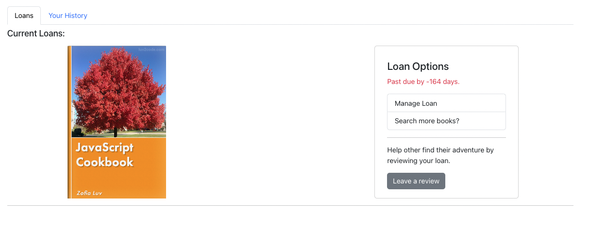

# 📚 Library System

A **React & TypeScript** powered **Library System** that allows users to browse, borrow, return, and review books, while administrators can manage the library, track book inventory, and handle user interactions. The system features a secure authentication flow using Okta, a user-friendly UI, and efficient book management tools.

## 🌟 Features

### 🎥 User Authentication
- **Login**: Secure login using Okta authentication.
- **Protected Routes**: Restricts access to certain pages unless logged in.
- **Login Callback**: Users are automatically redirected after authentication.

### 🔹 Home Page
- **Homepage**: Displays featured books and trending categories.
 

### 📜 Book Search & Book Details
- **Book Search**: Find books by title, author, or category.
- **Book Details**: View book descriptions, ratings, and availability.
 

### 📖 Personal Bookshelf, Loan History 
- **My Loans**: Keep track of borrowed books, due dates, and overdue status.  
- **Loan History**: View past borrowed books and manage your reading records.  

 

### 💬 Messaging System
- **User Messages**: Communicate with administrators directly.
- **Admin Notifications**: Receive system updates and important alerts.

## 📚 Overdue Books & Fees
If books are not returned on time, a **late fee** will be applied. No fees if returned on time. Overdue books will incur a charge. Fees can be paid under the **"Pay Fees"** section.
#### ❌ Overdue Fees  

#### ✅ No Fees  

### 🚀 Admin Panel
- **Manage Books**: Add, remove, or update book details.
- **Inventory Control**: Adjust book quantities and availability.
- **User Management**: Monitor borrowed books and overdue fines.

